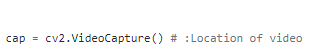

# lane_detection
using opencv we detect road lane

Give the location of video in which we want to detect lane.

for example: cap = cv2.VideoCapture(r'C:\Users\user-pc\Desktop\demo.mp4') # :Location of video
## Demo Video

